# 🚀 TransitHub | Capstone Project

**TransitHub** is a sophisticated transportation management platform designed to streamline the coordination between Customers, Coordinators, Operators, and Drivers. The platform is divided into a web application for Customers and Coordinators and a mobile application dedicated to Operators and Drivers.

### Screen Captures

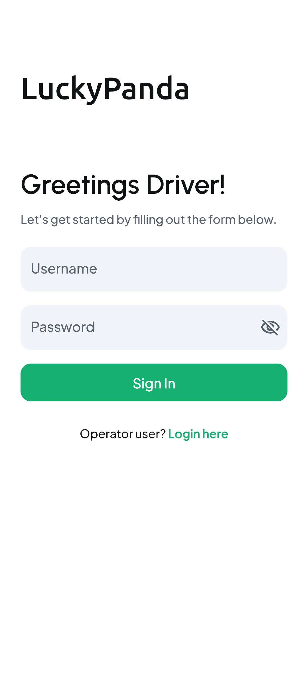

<em>A secure login interface for drivers</em>

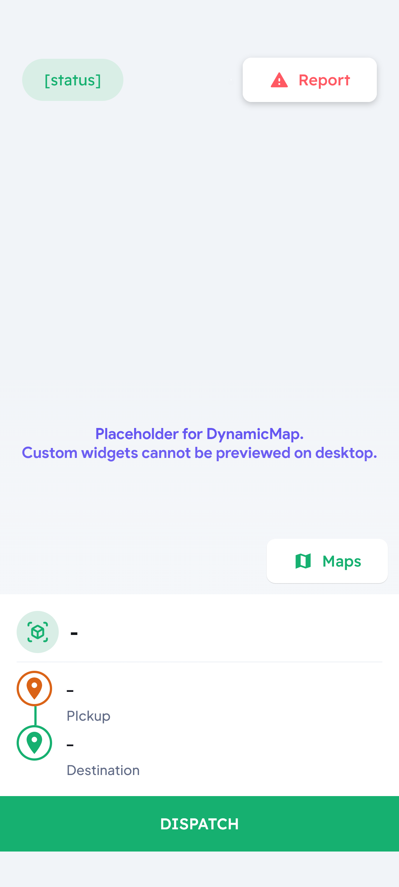

<em>Main dashboard for drivers to monitor their activities</em>

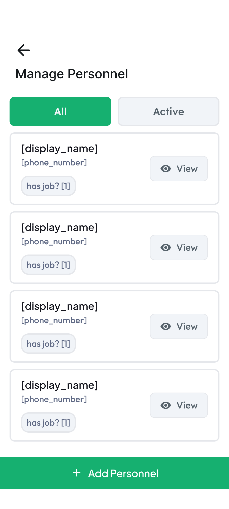

<em>Team management and collaboration tools</em>

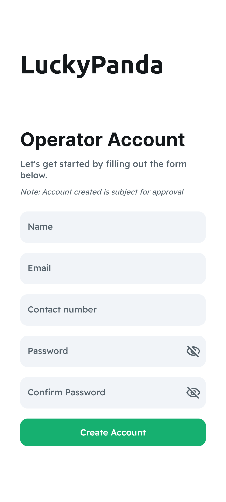

<em>Step-by-step account creation process</em>

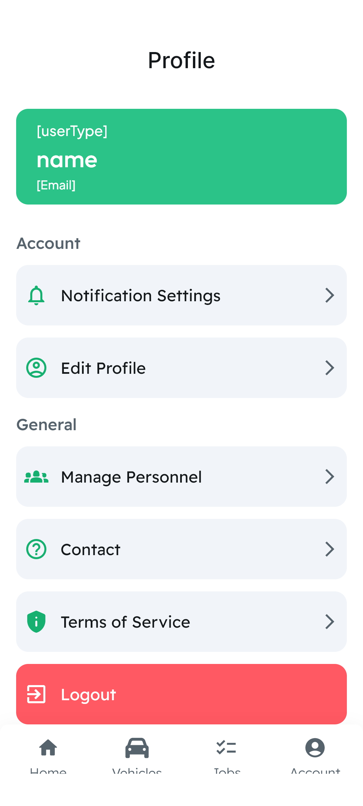

<em>A centralized view of user profile information</em>

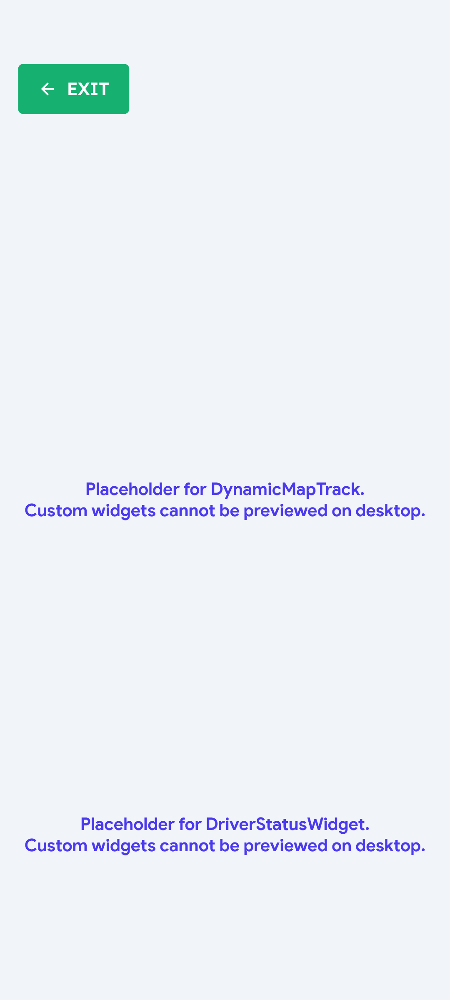

<em>Real-time tracking and location monitoring</em>

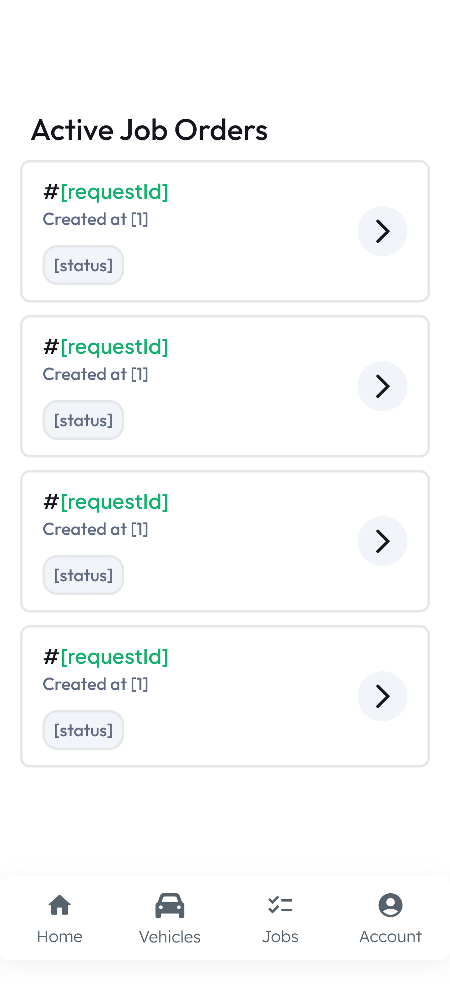

<em>Current jobs and their statuses</em>

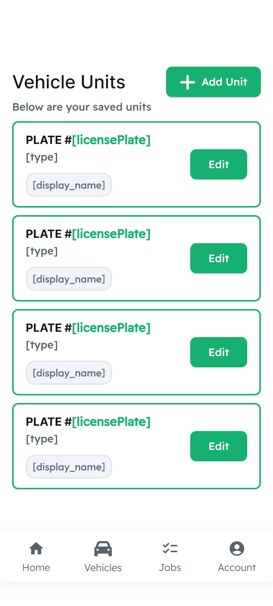

<em>Comprehensive overview of fleet vehicles</em>

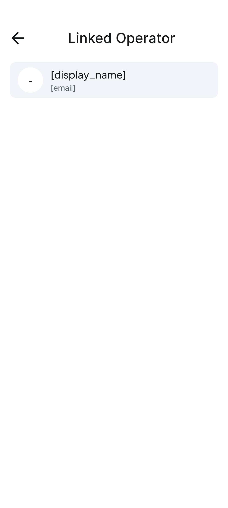

<em>Connecting drivers with their vehicle assignments</em>

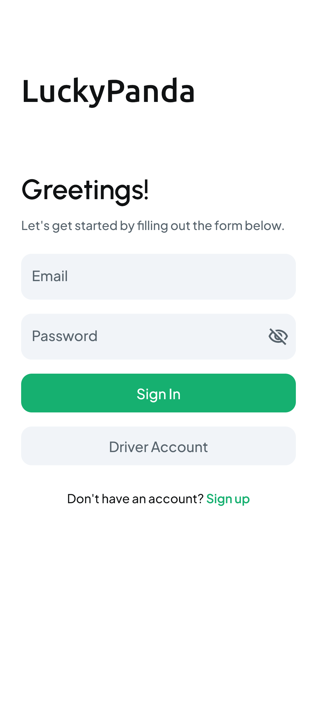

<em>Default login screen for user authentication</em>

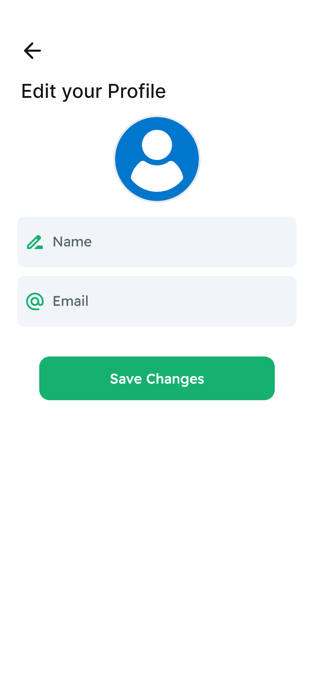

<em>Customizable profile settings with instant updates</em>

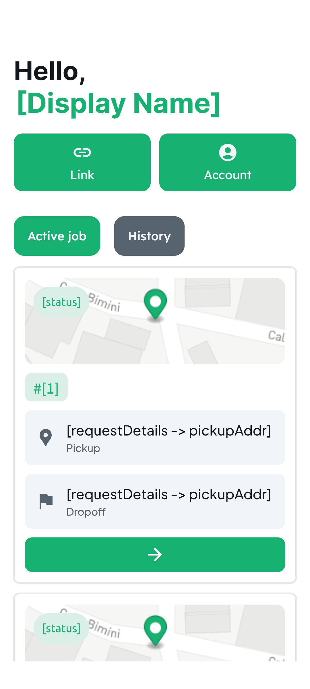

<em>Key features accessible at a glance</em>

---

## 🌟 Key Features

### 📝 Customer Job Input
- Customers can input job details via the web application, specifying call times, pickup and destination points, vehicle types, and the number of vehicles needed.
- These details are converted into booking requests for Coordinators to review and manage.

### 📋 Coordinator Management
- Coordinators oversee booking requests, selecting from the pool of job requests and matching them with available Operators.
- Coordinators can view Operators' schedules and vehicle availability on their mobile app.
- Assigning bookings to Operators triggers notifications, informing them of their new job assignments.
- Unassigned bookings within the specified availability window are automatically purged from the system.

### 🚚 Operator and Driver Workflow
- Operators receive job orders with barcodes in the job details.
- Drivers, operating in guest mode, can scan these barcodes to access job information.
- Operators who take on the Driver role can bypass barcode scanning and proceed directly to the job.
- Vehicle tracking updates are required at various stages: dispatch, arrival, loading, in transit, unloading, and delivery.
- Photographic evidence is captured at each stage for verification purposes.
- The mobile interface includes an incident report feature for Drivers to report issues during transit back to the Coordinator.

### 💬 Communication and Notifications
- An integrated chat system facilitates real-time communication among users, enhancing collaboration and support.
- Conversations are tracked, and messages are marked as read or unread to maintain an efficient flow of information.
- The notification system alerts users to job assignments, incident reports, and other critical updates, keeping all stakeholders promptly informed.

## 🛠 Technologies Used
- **Web Application:** Built using modern web technologies for Customers and Coordinators.
- **Mobile Application:** Developed using Flutter for cross-platform compatibility, dedicated to Operators and Drivers.
- **Database:** Firebase Firestore for real-time data synchronization.
- **Communication:** Integrated chat system for real-time messaging.
- **Notification System:** Alerts users to important updates and job assignments.

## 🎯 Project Goals
- Streamline the coordination process between Customers, Coordinators, Operators, and Drivers.
- Ensure real-time tracking and updates of vehicle statuses.
- Facilitate seamless communication and collaboration among all user roles.
- Provide Partners with a reliable interface to book and track shipments.
